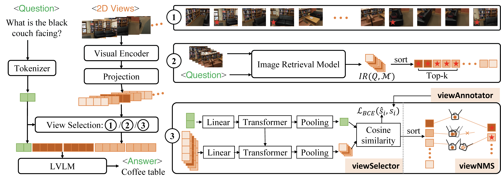

# cdViews
This repository contains the official PyTorch implementation of the following paper:

Title: 3D Question Answering via only 2D Vision-Language Models  [PDF](TODO)

Author: [Fengyun Wang](https://scholar.google.com/citations?user=y1--5LMAAAAJ&hl=en), [Sicheng Yu](https://scholar.google.com/citations?hl=en&user=seCkFT8AAAAJ&view_op=list_works&sortby=pubdate), [Jiawei Wu](https://scholar.google.com/citations?hl=en&user=ZEK5VeUAAAAJ&view_op=list_works&sortby=pubdate), [Jinhui Tang](https://scholar.google.com/citations?user=ByBLlEwAAAAJ&hl=zh-CN), [Hanwang Zhang](https://personal.ntu.edu.sg/hanwangzhang/),  [Qianru Sun](https://qianrusun.com/)

Affiliation: NTU, SMU, NUS, NJUST, SMU

## Abstract
Large vision-language models (LVLM) have significantly advanced numerous fields. In this work, we explore how to harness their potential to address 3D scene understanding tasks, using 3D question answering (3D-QA) as a representative example.
Due to the limited training data in 3D, we do not train \vlms but infer in a zero-shot manner.
Specifically, we sample 2D views from a 3D point cloud and feed them into 2D models to answer a given question. When the 2D model is chosen, e.g., LLAVA-OV, the quality of sampled views matters the most.
We propose cdViews, a novel approach to automatically selecting **c**ritical and **d**iverse **Views** for 3D-QA.
cdViews consists of two key components:
**viewSelector** prioritizing critical views based on their potential to provide answer-specific information, and **viewNMS** enhancing diversity by removing redundant views based on spatial overlap.
We evaluate cdViews on the widely-used ScanQA and SQA benchmarks, demonstrating that it achieves state-of-the-art performance in 3D-QA while relying solely on 2D models without fine-tuning. These findings support our belief that 2D LVLM are currently the most effective alternative (of the resource-intensive 3D LVLM) for addressing 3D tasks.


## Overall architecture

The pipeline of zero-shot 3D-QA using three different view selection methods: uniform sampling (option ①),
image retrieval (option ②), and our cdViews (option ③). The views marked with ★ are selected ones. As for inference,
our cdViews has two modules to run: the viewSelector identifies critical views, and the viewNMS enhances view
diversity and minimizes redundancy. The viewSelector is trained using automatically generated labels from the
viewAnnotator module.

## Installation

### 1. **Clone this repository and navigate to the LLaVA folder:**
```bash
git clone cdViews
cd cdViews
```

### 2. **Install the inference package:**
```bash
# following the project llava
conda create -n cdViews python=3.10 -y
conda activate cdViews
pip install --upgrade pip
pip install -e ".[train]"
```

### 3. **Install the other package:**
```bash
pip install easydict flash-attn==2.5.7
```

## Data preparation
### **ScanQA**:
We follow the project of [ScanQA](https://github.com/ATR-DBI/ScanQA/blob/main/docs/dataset.md) for data preparation.

1. Download the [ScanQA dataset](https://drive.google.com/drive/folders/1-21A3TBE0QuofEwDg5oDz2z0HEdbVgL2) under data/qa/ScanQA/

**Dataset format**
```
"scene_id": [ScanNet scene id, e.g. "scene0000_00"],
"object_id": [ScanNet object ids (corresponds to "objectId" in ScanNet aggregation file), e.g. "[8]"],
"object_names": [ScanNet object names (corresponds to "label" in ScanNet aggregation file), e.g. ["cabinet"]],
"question_id": [...],
"question": [...],
"answers": [...],
```
2. Download and unzip [the extracted ScanNet frames](http://kaldir.vc.in.tum.de/3dsis/scannet_train_images.zip) under `data/scannetv2`

### **SQA**:
We follow the project of [SQA3D](https://github.com/SilongYong/SQA3D/blob/master/ScanQA/README.md) for data preparation.
1. Download the preprocessed [SQA_data_in_ScanQA_format](https://zenodo.org/record/7792397/files/ScanQA_format.zip?download=1) in `data/qa/SQA/`

### **LLAVA-OV model**:
Download the **LLAVA-OV** pretrained model to `data/qa/model/`
```bash
apt-get install git-lfs
git lfs install
git clone https://huggingface.co/lmms-lab/llava-onevision-qwen2-7b-ov.git
```

After preparing, the `data/qa` folder should look like this:
```
| scannetv2
|   |---frames_square
|   |   |---scene0000_00
|   |   |   |---color
|   |   |   |---depth
|   |   |   |---...
|   |   |---scene0000_01
|   |   |---......
| ScanQA
|   |---ScanQA_v1.0_train.json
|   |---ScanQA_v1.0_val.json
|   |---ScanQA_v1.0_test_w_obj.json
|   |---ScanQA_v1.0_test_wo_obj.json
| SQA
|   |---SQA_train.json
|   |---SQA_test.json
|   |---SQA_val.json
| model
|   |---llava-onevision-qwen2-7b-ov
```


## Download Weights and Files

| Processing         |                                                                                                                                                                      ScanQA                                                                                                                                                                      |                                                   SQA                                                   |
|:-------------------|:------------------------------------------------------------------------------------------------------------------------------------------------------------------------------------------------------------------------------------------------------------------------------------------------------------------------------------------------:|:-------------------------------------------------------------------------------------------------------:|
| Caption Generation |                                                                                                                      [ScanQA_captions](https://drive.google.com/file/d/1Yo23d61fQApWJIdfAbV67M2X7C_5SEKl/view?usp=sharing)                                                                                                                       |   [SQA_captions](https://drive.google.com/file/d/1lTdkHAVsAHScTeCbawbpG9wDKphcfaDL/view?usp=sharing)    |
| View Matching      |                                                                                                                    [ScanQA_view_labeling](https://drive.google.com/file/d/1x832zSViIkFu-3SpKNVoManKzpjXVPT3/view?usp=sharing)                                                                                                                    | [SQA_view_labeling](https://drive.google.com/file/d/1r0BqRz5uXXxUzWBz3vTXpQflzn2UTW9a/view?usp=sharing) |
| Checkpoint         |                                                                                                                    [ScanQA_view_selector](https://drive.google.com/file/d/1J_A0SZzFjkzgtkFTsLjDH8EO6BVZbDX0/view?usp=sharing)                                                                                                                    |                                            [SQA_view_selector](https://drive.google.com/file/d/1PHeQ5yeHYEGyN1JFTysh1HP8kvuW-KCn/view?usp=sharing)                                             |
|Ranked View List |                                   [ScanQA_val_view_ranking](https://drive.google.com/file/d/151RXXI43CaMRhhv9GWbmnHNQ4s9t9C4w/view?usp=sharing),  [ScanQA_test_w_obj_view_ranking](https://drive.google.com/file/d/1RQVmMNr0Z6a-CJzgKwkvHq1Vvdo256ud/view?usp=sharing),   [ScanQA_test_wo_obj_view_ranking](https://drive.google.com/file/d/1IEedi70-rASTSwS43V5y_-taI3XKpcFp/view?usp=sharing)                                    | [SQA_test_view_ranking](https://drive.google.com/file/d/1jq37eEIkQgDy5mzuejt6leScXzkIvhQj/view?usp=sharing)
| Predicted Answers  | [ScanQA_val_answers](https://drive.google.com/file/d/1D9ahw-Va1e1HOy5n690hj0uuhcIiaD9k/view?usp=sharing),   [ScanQA_test_w_obj_answers](https://drive.google.com/file/d/1IZHuLuAfxeJxpkRmTmr6UkW5KL_OubL6/view?usp=sharing),    [ScanQA_test_wo_obj_answers](https://drive.google.com/file/d/1D9ahw-Va1e1HOy5n690hj0uuhcIiaD9k/view?usp=sharing) | [SQA_test_answers](https://drive.google.com/file/d/1Wyv2JIQslKv1U3qE9DEWmZUMc2j-jPMk/view?usp=sharing)  |


## Training

### viewAnnotator

It consists of two steps: caption generation and view matching. You can directly download the prepared view labeling ([ScanQA](ttps://drive.google.com/file/d/1x832zSViIkFu-3SpKNVoManKzpjXVPT3/view?usp=sharing) / [SQA](https://drive.google.com/file/d/1r0BqRz5uXXxUzWBz3vTXpQflzn2UTW9a/view?usp=sharing)) and skip below 2 steps. (Strongly Recommended)
- Step 1: caption generation

```bash
python caption_generation.py --model-path /data/qa/model/llava-onevision-qwen2-7b-ov
```
You can directly download the prepared captions ([ScanQA](https://drive.google.com/file/d/1Yo23d61fQApWJIdfAbV67M2X7C_5SEKl/view?usp=sharing) / [SQA](https://drive.google.com/file/d/1lTdkHAVsAHScTeCbawbpG9wDKphcfaDL/view?usp=sharing)) and skip this step.


- Step 2: view matching

```bash
python view_matching.py
```
You can directly download the prepared view labeling ([ScanQA](https://drive.google.com/file/d/1x832zSViIkFu-3SpKNVoManKzpjXVPT3/view?usp=sharing) / [SQA](https://drive.google.com/file/d/1r0BqRz5uXXxUzWBz3vTXpQflzn2UTW9a/view?usp=sharing)) and skip this step.

### viewSelector

```bash
# 1. Saving image features for each view to speed up the training of the view selector
python visual_feature_processing.py

python train.py
```

## Inference

```bash
python qa_inference.py
```

## Performance
| Method | Type | EM@1 | BLEU-1 | ROUGE | CIDEr | SQA EM@1 |
|-------|------|-------|---------|--------|---------|-----------|
| ScanQA (Azuma et al., 2022) | 3D | 23.5 / 20.9 | 31.6 / 30.7 | 34.3 / 31.1 | 67.3 / 60.2 | 45.3 |
| SQA3D (Ma et al., 2022) | 3D | - | - | - | - | 47.2 |
| 3D-LLM (Hong et al., 2023) | 3D | 19.1 / - | 38.3 / - | 35.3 / - | 69.6 / - | 48.1 |
| 3D-VLP (Jin et al., 2023a) | 3D | 24.6 / 21.6 | 33.2 / 31.5 | 36.0 / 31.8 | 70.2 / 63.4 | 48.5 |
| 3D-VisTA (Zhu et al., 2023) | 3D | 27.0 / 23.0 | 39.7 / 36.8 | 39.2 / 33.7 | 76.6 / 62.6 | 48.5 |
| SIG3D (Man et al., 2024a) | 3D | 27.6 / 24.1 | - | - | - | 52.6 |
| SynFormer3D (Yang et al., 2024a) | 3D | - | - | - | - | - |
| LL3DA (Chen et al., 2024a) | 3D+2D | - | - | 38.2 / 35.2 | 78.2 / 70.3 | - |
| PQ3D (Zhu et al., 2025) | 3D+2D | 26.1 / 20.0 | 43.0 / 36.1 | 38.7 / 65.2 | 87.8 / 65.2 | 47.1 |
| BridgeQA (Mo & Liu, 2024) | 3D+2D | 31.3 / 30.8 | 34.5 / 34.4 | 43.3 / 41.2 | 83.8 / 79.3 | 52.9 |
| LLAVA-OV + F_uniform | 2D | 33.1 / 33.5 | 43.2 / 44.2 | 46.9 / 46.6 | 95.8 / 93.3 | 53.5 |
| LLAVA-OV + F_retrieval | 2D | 33.9 / 34.6 | 44.8 / 46.1 | 48.3 / 45.7 | 98.8 / 97.7 | 55.9 |
| **LLAVA-OV + F_cdviews** | 2D | **35.0 / 35.6** | **46.1 / 47.2** | **49.7 / 49.5** | **102.8 / 100.4** | **56.8** |
| *margin over the compared best* | - | 3.7↑ / 4.8↑ | 3.1↑ / 9.1↑ | 6.4↑ / 8.3↑ | 15.0↑ / 21.1↑ | 3.9↑ |

*Note: For the performance of **LLAVA-OV + F_cdviews** in SQA, the score 56.8 is obtained using `eval_sqa3d_llm.py` (the [official LLM-based evaluation script](https://github.com/SilongYong/SQA3D/blob/master/LLM/eval_sqa3d_llm.py) provided by the SQA benchmark). The score 51.4 is the Refined EM result evaluated using the official [LLaVA-3D](https://github.com/ZCMax/LLaVA-3D/blob/main/llava/eval/sqa3d_evaluator.py) strict-match evaluation code. We sincerely thank the helpful comments and evaluation comparison in [Issue #4](https://github.com/fereenwong/cdViews/issues/4).*


## Citation

If you find it useful for your research and applications, please cite related papers/blogs using this BibTeX:
```bibtex
TODO
```


## Related Projects

- This code is based on [LLaVA-NeXT](https://github.com/LLaVA-VL/LLaVA-NeXT)
- [ScanQA](https://github.com/ATR-DBI/ScanQA/tree/main)
- [SQA](https://github.com/SilongYong/SQA3D)
